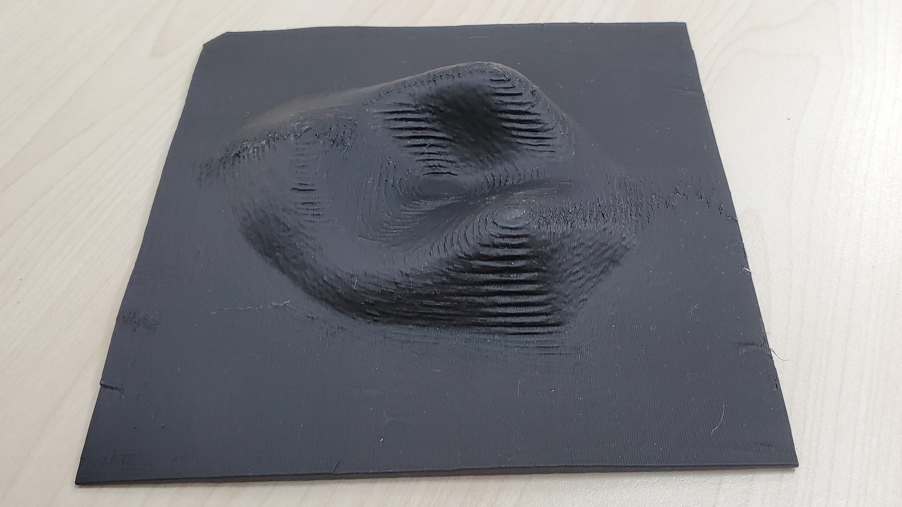

# 「誰もが知りたいもの、必要なものを自由に手に入れ、触れられる社会」の創成に向けた3Dモデル提供体制の開発と実装

## 2021年度 「SDGsの達成に向けた共創的研究開発プログラム」採択課題

# NEWS

## シンポジウムのお知らせ

2023年8月5日に
[シンポジウム「形のないものに触る」](sympo8.md)
をオンライン
で開催します。 (2023/07/02)

海外からの参加含め、１７０名を超える参加をいただきました。
シンポジウムの様子が毎日新聞８月３０日夕刊で紹介されました。

[形なきもの、触れて理解　3Dプリンターでブラックホール模型　視覚障害者の学びに活用](https://mainichi.jp/articles/20230830/dde/041/040/019000c)

(2023/09/11)

---

## イベントのお知らせ

本プロジェクトの協力組織
[ファブラボ品川](https://www.fablab-shinagawa.org/)
が主催し
2023年5月4日から6日に
日本科学未来館で
開催する
[ファブリカリウム 東京 2023](https://fabrikarium-tokyo.org/)
にプロジェクト代表の南谷が
障害などのニーズを持った当事者
として参加します。
参加申し込み受付中。　(2023/02/25)

---

## シンポジウムのお知らせ

2023年2月11日に
[シンポジウム「日本全国模型巡り(1)」](sympo7.md)
をオンライン
で開催します。 (2023/01/05)

海外からの参加含め、今回も１６０名ほどの参加をいただき、盛会のうちに終了しました。

(2023/02/25)

---

## サービス紹介記事の掲載

東京ヘレンケラー協会が発行する点字雑誌『点字ジャーナル』2022年11月号に
利用者の方が3Dモデル提供サービス
について寄稿されました。

[３Dモデル触察のすすめ―サグラダ・ファミリアとマッターホルン―](https://thka.jp/885/#column2)

(2023/01/04)

---

## プロジェクト紹介記事の掲載

SDGs MAGAZINE に本プロジェクトの活動が紹介されました。 

[視覚障がい者はどう「日本列島の形」を知る？「3Dモデル」の可能性 ](https://sdgsmagazine.jp/2022/10/04/7726/)

(2022/10/08)

---

## 受賞のお知らせ

研究代表者南谷が製作に参加した作品
「Candeco―視覚障害者が手放せない白杖で自分らしさを追求できるプラットホーム―」が
[日本感性工学会「かわいい感性デザイン賞（第10回）」](https://kawaii-award.org/award2022/)
最優秀賞を受賞しました。

---

## シンポジウムのお知らせ

2022年8月11日に
[シンポジウム「わたしの3Dモデル活用術」](sympo6.md)
をオンライン
で開催します。 

全国から１６０名を超える皆様の参加をいただき、盛会のうちに終了しました。

ウェブメディアのギズモード・ジャパンでシンポジウムの様子を紹介いただきました。
[オンライン会議の限界は、｢3Dプリンティング技術｣で乗り越えられるかもしれない](https://www.gizmodo.jp/2022/08/3d-printing-for-video-meeting.html)

---

## 登壇

６月１７日にオンラインで日本とフランスをつないで開催されるメイカソンイベント
[FABRIKARIUM TOKYO – Make the world a better place\.](https://fabrikarium-tokyo.org/)
に研究代表者南谷が登壇します。

---

## 出演

日本点字図書館が発行している録音雑誌
『にってんデイジーマガジン』
２０２２年5月号の
「人、話題の窓」に研究代表者南谷が
出演し、本
プロジェクトを紹介しました。

『にってんデイジーマガジン』
は、
視覚障害者を始め、 目で文字を読むことが困難な人のための電子図書館
[サピエ](https://www.sapie.or.jp/)
で聞くことができます。 (2022/05/05)

---

## 調査・訪問

奈良県⽴橿原考古学研究所付属博物館を訪問しました。
展示中の
⾼松塚古墳壁画を再現した
陶板を拝見・触察し、
壁画の意義や
陶板の製作過程について
担当者の方のお話をうかがいました。 (2022/04/13)

参考: [触れる高松塚壁画　よみがえる「ぬれ色」　複製陶板7点完成 \| 毎日新聞](https://mainichi.jp/articles/20220313/ddm/041/040/107000c)

---

## 出演の紹介

プロジェクトメンバーの岩村と南谷が
ＪＢＳ日本福祉放送(USEN チャンネル:K08)の「竹田と山口の時々役立ちラジオ」第74回に出演しました。下記のURLからオンデマンドで聴けます。
[http://www.jbs.or.jp/on-demand/on-demand.html](http://www.jbs.or.jp/on-demand/on-demand.html)
[直接再生はこちら](http://www.jbs.or.jp/broadcasting/ondemand/radio/radio-NO74-40min.mp3)

---

## 雑誌への寄稿

[『教育と医学』第70巻1号(通巻808号、2022年1・2月号)](https://www.keio-up.co.jp/kyouikutoigaku/202201-02/)
に研究代表者南谷がプロジェクトで開催してきたシンポジウムを取り上げた記事
「コロナ禍以後の障害児教育(2)―オンラインシンポジウム開催で得たもの」
を寄稿しました。

---

## シンポジウムのお知らせ

2022年2月5日に
[シンポジウム「触って感じる美しさを探る」](sympo5.md)
をオンラインと対面のハイブリッドで開催します。 

感染症蔓延防止に鑑み対面開催を見送ることとなりましたが、
全国から１５０名を超える皆様の参加をいただき、盛会のうちに終了しました。

---

## 「SDGsの達成に向けた共創的研究開発プログラム」採択のお知らせ

「『誰もが知りたいもの、必要なものを自由に手に入れ、触れられる社会』の創成に向けた3Dモデル提供体制の開発と実装」の課題で
科学技術振興機構
2021年度 「SDGsの達成に向けた共創的研究開発プログラム」
〔ソリューション創出フェーズ〕に採択されました。
2019年度から実施してきた「共創的支援を促進する視覚障害者のための３Ｄ造形物配信・出力エコシステムの構築」に引き続き同プログラムの支援で研究を継続します。

参考: 科学技術振興機構(JST)の紹介ページ
[「誰もが知りたいもの、必要なものを自由に手に入れ触れられる社会」の創成に向けた、3Dモデル提供体制の開発と実装 \- SOLVEシナリオ・ソリューション](https://www.jst.go.jp/ristex/solve/project/solution/solution21_minatanipj.html)

---

## オンラインシンポジウムのお知らせ
2021年8月13日に
[オンラインシンポジウム「触れる体験の今とこれから」](sympo4.md)
を開催します。 

全国から１５０名近い皆様の参加をいただき、今回も盛会のうちに終了しました。

広島産業奨励館と原爆ドームの3Dモデルデータは
独立行政法人　国立特別支援教育総合研究所の
[金子健](https://www.nise.go.jp/nc/study/researcher_list/kaneko)
先生に紹介いただきました。記して感謝します。

---

## オンラインシンポジウムのお知らせ
2021年2月6日に
[オンラインシンポジウム「触ることからのメッセージ」](sympo3.md)
を開催します。 

全国から１００名を超える皆様の参加をいただき、盛会のうちに終了しました。

---

## コンテストでの入選
日本図学会主催の
[第12回デジタルモデリングコンテスト](https://www.graphicscience.jp/contest/20_list_detail.html)
において
研究代表者南谷の作品「パラメトリック・ピサの斜塔―視覚障害者のCAD手法の実例として―」が最優秀賞を受賞しました。

---

## オンラインシンポジウムのお知らせ
2020年8月8日に
[オンラインシンポジウム「コロナの時代に考える触ることの大切さ」](sympo2.md)
を開催します。 

全国から参加いただき、盛会のうちに終了しました。

---

## 雑誌への寄稿
[『教育と医学』第68巻4号(通巻799号、2020年7・8月号)](https://www.keio-up.co.jp/kyouikutoigaku/202007-08/)
に研究代表者南谷が本プロジェクトの趣旨を開設した記事
「３Dプリンタが開くDIY支援機器の世界」を寄稿しました。

---

## プロジェクトの紹介記事
視覚障害者の見る工夫を集めたwebメディア
[ミルクフ](https://mirukufu.com/)
にプロジェクトの紹介記事が掲載されました。

[SDGsの理念とともに、3Dモデルが切り拓く視覚障害者を取り残さない社会 | ミルクフ　～見る工夫を見つける身につける～](https://mirukufu.com/2020/05/26/3d-model-project/)

---

## 雑誌への寄稿
[『教育と医学』第68巻3号(通巻798号、2020年5・6月号)](https://www.keio-up.co.jp/kyouikutoigaku/202005-06/)
に研究代表者南谷が本プロジェクトの趣旨を開設した記事
「建物から考える『言葉で表し切れないものを知ることの大切さ』」を寄稿しました。

---

## 市民報告会: 「あなたの触りたいものを届けます」―【共創的支援を促進する視覚障害者のための3D造形物配信・出力エコシステムの構築】スタートアップシンポジウム―

私たちは、2019年末より「視覚障害者が知りたいものをいつでもどこでも自由に手に入れ触れられる社会」の2030年実現を目指し研究を進めています。
この研究の一環として、3Dモデル(模型)の提供サービスを試験運用します。
今回のシンポジウムでは、本プロジェクトの趣旨説明と、3Dモデル提供サービス(試験版)の利用方法の解説を行います。
触りたい模型のある視覚障害者の皆さん、模型を届けたいと考えている支援者の皆さん、CADを活用した支援に関心のある皆さん、その他プロジェクトに興味のある皆さんの参加をお待ちしています。

盛会のうちに終了しました。参加いただいたみなさん、ありがとうございました。
)

『点字ジャーナル』2020年4月号にシンポジウムの紹介記事が掲載されました。
[あなたの触りたいものを届けます――3Dモデルから広がる世界――](https://www.thka.jp/shupan/journal/202004.html#feature02)

---

# サービス案内
* [日本語](service.html)
* [English](service-en.html)

# 人

| 役割 | 名前 | 所属 |
| :---: | :---: | :---: |
|研究代表者 | [南谷 和範](https://www.dnc.ac.jp/research/kenkyukaihatsu/member.html#minatani) | 独立行政法人 大学入試センター 研究開発部　教授|
|協働実施者 | [渡辺 哲也](http://vips.eng.niigata-u.ac.jp/) | 新潟大学 工学部　教授|
|主たる実施者 | [岩村 雅一](http://imlab.jp/~masa/)|大阪府立大学 大学院工学研究科 准教授|
|研究協力者 | [元木 章博](https://researchmap.jp/motocky/) | 鶴見大学 文学部ドキュメンテーション学科 教授|
