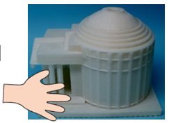

# シンポジウム「写真は触って分かるのか？
## ―『目の見えない人と見える人が共に世界を知り楽しむ立体カメラ開発』に向けて―」(3D4SDGsプロジェクト第12回シンポジウム)

2025年度より私たちはキヤノン財団の助成をいただき「目の見えない人と見える人が共に世界を知り楽しむ立体カメラ開発」研究プロジェクトを開始しました。
今回のシンポジウムでは本プロジェクトの目標や我々のこれまでの開発成果を紹介します。
また、視覚障害者が写真を楽しむためのワークショップ的トークを行います。

今回の取り組みは、JST(科学技術振興機構)のご支援の下2019年より3D4SDGsプロジェクトと称して行ってきた研究の延長線上にあり、オンラインシンポジウムとしては第12回となります。
このシンポジウムシリーズでは定番の3Dモデル事前郵送提供も準備しています。
詳しくは以下の案内をご覧ください。

[PDF版ご案内](sympo12-flyer.pdf)

---

### 記 

- 日時： 2025年9月23日（火）14時から16時半（終了時刻は予定）

- 参加費: 無料

- 開催形式:オンライン開催（Zoom 使用）

- 主催： 大学入試センター南谷和範研究室、大阪公立大学岩村雅一研究室

- スペシャルアドバイザー: いけがみ眼科整形外科 眼科専門医澤崎弘美先生

### プログラム 

- 14:00-14:30 趣旨説明: 「目の見えない人と見える人が共に世界を知り楽しむ立体カメラ開発」プロジェクトの背景や描く未来の姿について説明します。

- 14:30-15:00 現段階の開発成果: プロジェクトで技術開発を担当している岩村研究室から実例を用いて写真レリーフ化の状況を紹介します。

- 15:00-15:10 休憩1

- 15:10-15:50 視覚障害者の視覚障害者による視覚障害者のための物の見え方の説明(1): 物の見え方についての健常者の説明は、視覚障害者にとって分かりづらいことが少なくありません。
他方で見える様子を写し取る写真を楽しむためにはこの難問にも取り組む必要があります。
そこで、自信視力0の視覚障害者である研究代表者南谷が、視覚障害者にとっても納得できる見え方についての解説に挑戦します。
（かなり冒険的な企画であること、予めご承知おきください。）

- 15:50-15:55 休憩2

- 15:55-16:15 質疑応答 

- 16:15-16:30 情報コーナー、事務連絡

### 参加申し込み 
申し込みは、9月16日までに 

- 1. メールアドレス 

- 2. 氏名 

- 3. 所属（居住地、勤務先など任意） 
を記載して 
3d4sdgs+sympo12@gmail.com
宛メールでお願いします。あわせて 

- 4. このシンポジウムの情報をどこで知ったか 

教えていただけると参考になります。 
9月21日までに、お知らせいただいたメールアドレスへ参加に必要となるZoomのミーティング情報を送信します。 

シンポジウム当日に取り上げる3Dモデルを予め希望者に郵送することを計画しています。 
郵送を希望される方は、前述の氏名・メールアドレス等に加えて 

- 5. 視覚障害の有無 

- 6. 送付先住所・電話番号 

をお知らせください。 

ブラウザで申し込みを行いたい方は 
[申込フォーム](https://forms.gle/noARdENU6MtTU91PA)
からお願いします。 

### 注意事項 

- 3Dモデルの送付を希望する方は9月9日までに申込ください。 送付は視覚障害のある希望者を先着順で優先して取り組む予定です。その他希望者の方は可能な範囲での対応となること、ご容赦ください。 

- ウェブの申し込みフォームは、Googleアカウントでログインしていない状態で操作している場合などに、送信時に認証を求められることがあるようです。この場合、画像の選択か聞き取った英語音声の入力が必要になりますので、ご注意ください。 

- 申込時に提供いただいた情報は、シンポジウムの実施に関わるやり取りと3Dモデルのニーズ分析やプロジェクトの広報などのための統計的情報として利用します。 

- 当日は、主催者側でシンポジウムの撮影・録音を行う場合があります。 予めご承知おきください。 

--- 

### 参考

[プロジェクトインスタグラム:](https://instagram.com/3d4sdgs)
[情報配信申込](https://forms.gle/GfzDGNpBbWC3aSY4A)

「目の見えない人と見える人が共に世界を知り楽しむ立体カメラ開発」は
キヤノン財団「良き未来を拓く技術」
の助成に寄り実施されます。
本シンポジウムは科研費基盤研究(A)21H04419の共催により開催されます。

---

[サイトのトップページへ](index.md)

