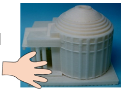

# シンポジウム「見て楽しむ東西名園を『触って味わう』―日本全国模型巡り(3)―」
## (3D4SDGsプロジェクト第13回シンポジウム)

我々は2020年以来、3Dプリンタで製作した触って楽しめる模型を活用したシンポジウムを開催してきました。
第13回となる今回のシンポジウムでは、見て楽しむ要素が多い日本庭園の魅力を、目の見える人と見えない人の間で共有する試みに挑戦します。
いつものメンバーに加えて、庭園関係者の皆様や新規研究プロジェクトのメンバーも交えてお送りします。
このシンポジウムシリーズでは定番の3Dモデル事前郵送提供も準備しています。
詳しくは以下の案内をご覧ください。

[PDF版ご案内](sympo13-flyer.pdf)

---

### 記 

- 日時： 2026年5月16日（土）13時半から16時（終了時刻は予定）

- 参加費: 無料

- 開催形式:オンライン開催（Zoom 使用）

- 主催： 大学入試センター南谷和範研究室、新潟大学渡辺哲也研究室、大阪公立大学岩村雅一研究室

### プログラム 

- 13:30-13:45 趣旨説明(南谷和範)

- 13:45-14:30 清澄庭園を歩き楽しむ（渡辺哲也）: 回遊庭園として有名な都立清澄庭園を、視覚障害者の皆さんも楽しめるように模型をつくりました。この模型を活用した説明を行います。

- 14:30-14:40 休憩

- 14:40-15:25 無鄰菴の真の魅力を解き明かす(南谷和範): 日本庭園の一つの醍醐味は、お庭の中で見せる情景の工夫にあります。ここでは、第7回のシンポジウムでも登場いただいた京都の名園無鄰菴を再度取り上げて、視覚障害者の皆さんにいまいち納得いただけなかった部分を掘り下げます。前回第12回のシンポジウムの話題「視覚障害者の視覚障害者による視覚障害者のための物の見え方の説明」と我々の写真立体化技術を駆使して、無鄰菴の妙味の核心に迫ります！

- 15:25-15:45 質疑応答 

- 15:45-16:00 情報コーナー、事務連絡

### 参加申し込み 
申し込みは、**5月7日**までに 

- 1 メールアドレス 

- 2 氏名 

- 3 所属（居住地、勤務先など任意） 

を記載して 
3d4sdgs+sympo13@gmail.com
宛メールでお願いします。あわせて 

- 4 このシンポジウムの情報をどこで知ったか 

- 5 視覚障害の有無 

を教えていただけると参考になります。 
5月14日までに、お知らせいただいたメールアドレスへ参加に必要となるZoomのミーティング情報を送信します。 

シンポジウム当日に取り上げる3Dモデルを予め希望者に郵送することを計画しています。 
郵送を希望される方は、前述の氏名・メールアドレス等に加えて 

- 6 送付先住所・電話番号 

をお知らせください。 
前回第12回のシンポジウムで視野の説明のために送付した積み上げ式の円錐模型を再度利用する予定です。
ご入用の方には在庫の範囲で送付しますので

- 7 円錐模型希望

とお書き添えください。

ブラウザで申し込みを行いたい方は 
[申込フォーム](https://forms.gle/z4hEK8H27iDdp7E38)
からお願いします。 

### 注意事項 

- 3Dモデルの送付を希望する方は**4月27日まで**に申込ください。 送付は視覚障害のある希望者を先着順で優先して取り組む予定です。その他希望者の方は可能な範囲での対応となること、ご容赦ください。 

- ウェブの申し込みフォームは、Googleアカウントでログインしていない状態で操作している場合などに、送信時に認証を求められることがあるようです。この場合、画像の選択か聞き取った英語音声の入力が必要になりますので、ご注意ください。 

- 申込時に提供いただいた情報は、シンポジウムの実施に関わるやり取りと3Dモデルのニーズ分析やプロジェクトの広報などのための統計的情報として利用します。 本シンポジウム実施のみでの利用を希望される方はその旨備考としてお書き添えください。

- 当日は、主催者側でシンポジウムの撮影・録音を行う場合があります。 予めご承知おきください。 

--- 

### 参考

[プロジェクトインスタグラム:](https://instagram.com/3d4sdgs)
[情報配信申込](https://forms.gle/GfzDGNpBbWC3aSY4A)

本シンポジウムは科研費研究(26H01924, 24H00162)、キヤノン財団「良き未来を拓く技術」、窓研究所研究助成の補助により開催されます。

---

[サイトのトップページへ](index.md)
